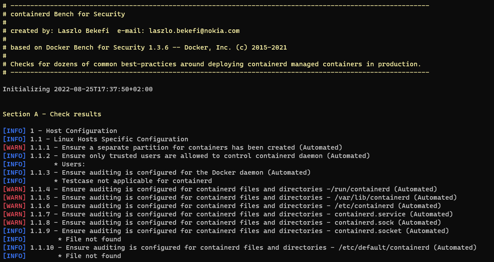

# Containerd Bench for Security



The Containerd Bench for Security is a script that checks for dozens of common best-practices around deploying containers with containerd in production. The tests are all automated, and are based on the [CIS Docker Benchmark v1.3.1](https://www.cisecurity.org/benchmark/docker/).

We are making this available as an open source utility so the user community of Containerd can have an easy way to self-assess their hosts and containers against this benchmark.

## Running Containerd Bench for Security

### Run from your base host

You can simply run this script from your base host by running:

```sh
git clone https://github.com/nokia/containerd-bench-security.git
cd containerd-security
sudo sh containerd-bench-security.sh
```

### Run as container

We provide a Dockerfile to build containerd bench as a small container for your convenience. Note that this container is being run with a *lot* of privilege -- sharing the host's filesystem, pid and network namespaces, due to portions of the benchmark applying to the running host.

First you will need to build the container based on the (descriptions)[#building-docker-image] and then run it. 

```sh
TODO: Add run instructions.
```

### Note

Note that when distributions do not contain `auditctl`, the audit tests will check `/etc/audit/audit.rules` to see if a rule is present instead.

### Containerd Bench for Security options

```sh
  -b           optional  Do not print colors
  -h           optional  Print this help message
  -l FILE      optional  Log output in FILE, inside container if run from container
  -u USERS     optional  Comma delimited list of trusted user(s)
  -c CHECK     optional  Comma delimited list of specific check(s) id
  -e CHECK     optional  Comma delimited list of specific check(s) id to exclude
  -i INCLUDE   optional  Comma delimited list of patterns within a container or image name to check
  -x EXCLUDE   optional  Comma delimited list of patterns within a container or image name to exclude from check
  -n LIMIT     optional  In JSON output, when reporting lists of items (containers, images, etc.), limit the number of reported items to LIMIT. Default 0 (no limit).
  -p PRINT     optional  Disable the printing of remediation measures. Default: print remediation measures.
```

By default the Containerd Bench for Security script will run all available CIS tests and produce
logs in the log folder from current directory, named `containerd-bench-security.sh.log.json` and
`containerd-bench-security.sh.log`.

If the container is used then the log files will be created inside the container in location `/usr/local/bin/log/`. If you wish to access them from the host after the container has been run you will need to mount a volume for storing them in.

The CIS based checks are named `check_<section>_<number>`, e.g. `check_2_6` and community contributed checks are named `check_c_<number>`.

`sh containerd-bench-security.sh -c check_2_2` will only run check `2.2 Ensure the logging level is set to 'info'`.

`sh containerd-bench-security.sh -e check_2_2` will run all available checks except `2.2 Ensure the logging level is set to 'info'`.

`sh containerd-bench-security.sh -e docker_enterprise_configuration` will run all available checks except the docker_enterprise_configuration group

`sh containerd-bench-security.sh -e docker_enterprise_configuration,check_2_2` will run allavailable checks except the docker_enterprise_configuration group and `2.2 Ensure the logging level is set to 'info'`

`sh containerd-bench-security.sh -c container_images -e check_4_5` will run just the container_images checks except `4.5 Ensure Content trust for Docker is Enabled`

Note that when submitting checks, provide information why it is a reasonable test to add and please include some kind of official documentation verifying that information.

## Building Docker image

You have two options if you wish to build and run this container yourself:

1. Use Docker Build: (**`Note: it requires docker to be installed!`**)

```sh
git clone https://github.com/nokia/containerd-bench-security.git
cd containerd-bench-security
docker build --no-cache -t containerd-bench-security .
```

Followed by an appropriate `run` command as stated above.

2. Use Docker Compose:

```sh
git clone https://github.com/nokia/containerd-bench-security.git
cd containerd-bench-security
docker-compose run --rm containerd-bench-security
```
